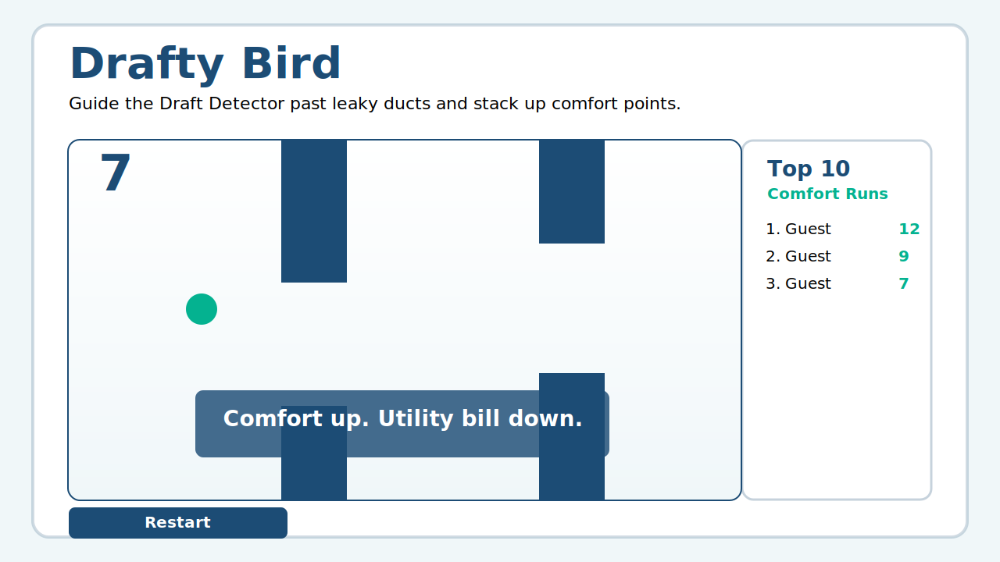

# Drafty Bird

A deploy-neutral SRE sample app: a Pearl-themed flappy game where your tiny Draft Detector dodges leaky ducts for comfort points.

Plan and design docs:
- `docs/PLAN.md`
- `docs/DECISIONS.md`
- `docs/ACCEPTANCE.md`



## What You Get
- Single Node.js TypeScript service (`apps/server`) serving both static web assets and API.
- React + TypeScript Canvas game (`apps/web`) with deterministic core game logic.
- Stable operational interfaces for SRE exercises:
  - `/healthz`, `/readyz`, `/metrics`
  - structured JSON logs with `request_id`
  - OpenTelemetry traces (HTTP + custom spans)
  - opt-in chaos injection controls
- Leaderboard persistence with SQLite when available, with in-memory fallback.

## Tech Stack
- Node.js `20.11.1` (see `.nvmrc`)
- TypeScript strict mode
- React + Vite
- Express
- Prometheus (`prom-client`)
- OpenTelemetry (`@opentelemetry/*`)
- pino JSON logging
- Vitest + Testing Library + Supertest

## Local Dev
```bash
npm install
npm run dev:server
```

In another terminal:
```bash
npm run dev:web
```

Open `http://localhost:5173`.

Notes:
- API server runs on `http://localhost:8080`.
- Web defaults to same-origin API in production; for Vite dev set `VITE_API_BASE=http://localhost:8080` if needed.

## Local Production Run
```bash
npm install
npm run build
npm start
```

Open `http://localhost:8080`.

## Docker
Build image:
```bash
docker build -f docker/Dockerfile -t drafty-bird:local .
```

Run container:
```bash
docker run --rm -p 8080:8080 -v drafty_bird_data:/data drafty-bird:local
```

Optional tracing demo with compose (app + collector + Jaeger UI):
```bash
docker compose -f docker/docker-compose.yml --profile observability up --build
```

Jaeger UI: `http://localhost:16686`

## API Endpoints
- `GET /healthz`
- `GET /readyz`
- `GET /metrics`
- `POST /game-start`
- `POST /score`
- `GET /leaderboard`

### `POST /score`
Request body:
```json
{
  "player": "Guest",
  "score": 12
}
```

Response:
```json
{
  "stored": {
    "player": "Guest",
    "score": 12,
    "createdAt": "2026-02-05T19:40:00.000Z"
  },
  "highScore": 18
}
```

## Metrics
`/metrics` exposes at least:
- `http_requests_total{route,method,status}`
- `http_request_duration_seconds_bucket{route,method,status,le}`
- `drafty_bird_games_started_total`
- `drafty_bird_games_completed_total`
- `drafty_bird_high_score`
- `drafty_bird_chaos_injections_total{type}`

## Logs
- JSON logs to stdout.
- `request_id` is included and echoed in `x-request-id` response header.
- Health and metrics endpoints are logged at low verbosity to avoid noisy steady state logs.

## OpenTelemetry Tracing
Backend tracing is enabled by default.

Behavior:
- If `OTEL_EXPORTER_OTLP_ENDPOINT` is set, spans export via OTLP HTTP.
- Otherwise, spans export to console (dev-friendly default).

Useful env vars:
- `OTEL_EXPORTER_OTLP_ENDPOINT` (example: `http://localhost:4318`)

Custom spans emitted:
- `score.submit`
- `leaderboard.query`
- `chaos.inject`

## Chaos Controls (Safe Defaults)
Chaos is disabled unless explicitly enabled.

- `CHAOS_ENABLED` (`false` default)
- `CHAOS_ERROR_RATE` (`0.0` to `1.0`, default `0`)
- `CHAOS_LATENCY_MS_P50` (default `0`)
- `CHAOS_LATENCY_MS_P99` (default `0`)
- `CHAOS_ROUTES` (default `/score,/leaderboard`)
- `CHAOS_SEED` (default `42`, deterministic PRNG seed)

When chaos injects, the app:
- increments `drafty_bird_chaos_injections_total{type}`
- logs a structured event
- tags traces with `chaos.injected=true` and `chaos.type`

## Storage
- Default DB path: `SCORE_DB_PATH=/data/db.sqlite`
- If SQLite cannot initialize, app falls back to in-memory storage and remains ready.
- Leaderboard policy: Top 10 all-time.

## CI
GitHub Actions workflow: `.github/workflows/ci.yml`

Pipeline runs:
- lint
- tests
- build
- docker image build

## Acceptance
See `docs/ACCEPTANCE.md` for the explicit acceptance checklist and verification commands.
