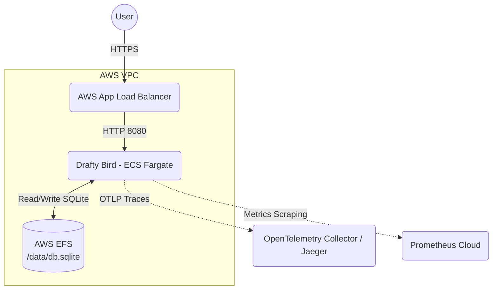

# Drafty Bird: SRE Production Architecture & Runbook

This document details the architecture, deployment strategy, and operational procedures to promote Drafty Bird to a production environment.

## 1. Deployment Architecture

Given the constraints (moderate traffic, reliability > scale, cost matters, containerized compute), the application will be deployed to **AWS Elastic Container Service (ECS) with AWS Fargate**. This serverless compute engine removes the need to manage EC2 instances while providing excellent isolation, reliability, and simplified scaling.

### Request Flow
1. **End User** connects to an AWS Application Load Balancer (ALB) via HTTPS.
2. **The ALB** terminates SSL/TLS and routes requests to the ECS Fargate service running the single `drafty-bird` Docker container.
3. The application runs as a stateless web node, *except* for the SQLite leaderboard data, which requires a persistent mount.
4. **AWS Elastic File System (EFS)** is mounted to the Fargate containers (`/data/db.sqlite`) to provide durable storage for the leaderboard across container restarts and deployments.

### Diagram

## 2. Telemetry: Health, Metrics, and Traces

**Service Health**
The ALB target group is configured to use the application's native `GET /healthz` endpoint. If the container becomes unresponsive, the ALB will automatically drain connections and ECS will spin up a replacement task. `readyz` is used during deployment to ensure new instances don't receive traffic until they're fully initialized.

**Metrics & Alarms**
We use Prometheus (or AWS Managed Prometheus). The container's `/metrics` endpoint is scraped periodically. Important alerts are based on:
1. **Traffic/Errors**: High error rate (`http_requests_total` for 5xx > 1%).
2. **Latency**: Apdex or p99 duration alerts using `http_request_duration_seconds_bucket` (e.g. p99 > 500ms).
3. **Availability**: Alerts if there are no available tasks running.

**Traces & Logging**
OpenTelemetry traces are critical, especially when evaluating the `chaos.injected=true` spans. 
Traces will be sent via OTLP (`OTEL_EXPORTER_OTLP_ENDPOINT`) to a collector like AWS X-Ray, Honeycomb, or Jaeger. When an alert triggers or a user reports an issue, we can search traces by `chaos.type` or `x-request-id` to identify which component induced the latency or failure.

## 3. Rollouts and Rollbacks

We utilize **AWS CodeDeploy for ECS** to execute **Blue/Green deployments**.
1. **Rollout (Green)**: When a new Docker image is pushed to ECR, CodeDeploy uses the ALB to spin up a new "Green" task family while keeping the "Blue" tasks serving production traffic. 
2. The ALB routes test traffic (e.g., via a specific test port or header) to the Green tasks. The `readyz` endpoint ensures the Green tasks are actually up.
3. **Shift**: Traffic is shifted over to Green. We can configure a Canary release (10% traffic for 5 minutes, then 100%) or linear shift.
4. **Rollback**: If CloudWatch Alarms (tied to Prometheus metrics like 5xx rate or latency) trigger during the bake period, CodeDeploy automatically rolls back to the Blue tasks.

## 4. Key Assumptions

1. The SQLite database traffic (`POST /score`, `GET /leaderboard`) fits within single-node concurrency limits; EFS can handle the IOPs. Multiple fast concurrent writes might cause SQLite `SQLITE_BUSY` errors on EFS, but we accept this as a tradeoff for a simple, single-container architecture until we migrate to Postgres.
2. For true high availability, we'd run at least 2 Fargate tasks. However, relying on SQLite on an EFS share means we'd have two processes trying to write to the same SQLite file simultaneously, which is an anti-pattern for concurrent network writes. *Assumption: We are running a single ECS task to ensure database consistency, relying on ECS auto-recovery if the task crashes.*

## 5. "If I had more time..." (Next Steps)

1. **Database Migration to Postgres**: To unlock true horizontal scaling (multiple container replicas), the first step is to drop SQLite in favor of a managed relational DB like AWS RDS PostgreSQL. EFS + SQLite is a bottleneck and anti-pattern for concurrent web architectures.
2. **CDN for Static Assets**: Create a CloudFront distribution sitting in front of the ALB. CloudFront would cache all the React (`apps/web`) static assets, significantly reducing load on the Node.js API server and reducing latency for players globally.
3. **Chaos Engineering Integration in Staging**: Formally build the chaos environment variables (`CHAOS_ERROR_RATE`, `CHAOS_LATENCY_MS_P99`) into non-production environments to regularly test the automated rollback and alerting mechanisms.
