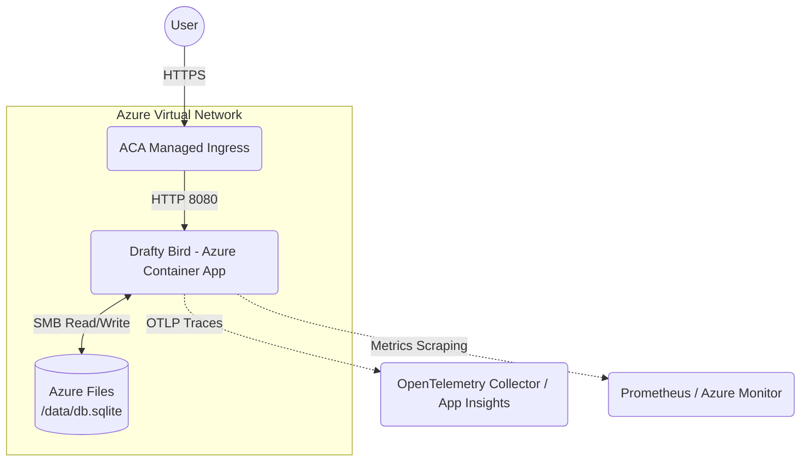

# Drafty Bird: SRE Production Architecture & Runbook

This document details the architecture, deployment strategy, and operational procedures to promote Drafty Bird to a production environment on **Microsoft Azure**.

## 1. Deployment Architecture

Given the constraints (moderate traffic, reliability > scale, cost matters, containerized compute), the application will be deployed to **Azure Container Apps (ACA)**. ACA is a serverless container service that removes the overhead of managing a full Kubernetes cluster (AKS) while providing dynamic scaling, KEDA driven autoscale, and native Envoy ingress.

### Request Flow
1. **End User** connects to the **Azure Container App Ingress** (native managed load balancing).
2. The managed ingress terminates SSL/TLS and routes HTTP traffic to the single active revision of the `drafty-bird` container.
3. The application runs statelessly, *except* for the SQLite leaderboard data, which requires a persistent mount.
4. **Azure Files** (part of an Azure Storage Account) is mounted into the ACA environment (`/data/db.sqlite`) via an SMB protocol connection to provide durable storage for the leaderboard across container restarts.

### Diagram

## 2. Telemetry: Health, Metrics, and Traces

**Service Health**
ACA utilizes standard Kubernetes-style probes. The application's native `GET /healthz` and `GET /readyz` endpoints are configured as liveness and readiness probes. If the container becomes unresponsive, ACA automatically replaces it. 

**Metrics & Alarms**
We use Prometheus (scraped via Azure Monitor Managed Prometheus) and Azure Log Analytics. Important alerts include:
1. **Traffic/Errors**: High error rate (`http_requests_total` for 5xx > 1%).
2. **Latency**: Apdex or p99 duration alerts using `http_request_duration_seconds_bucket` (e.g. p99 > 500ms).

**Traces & Logging**
OpenTelemetry traces are critical, especially when evaluating the `chaos.injected=true` spans. 
Traces export via OTLP (`OTEL_EXPORTER_OTLP_ENDPOINT`) to Application Insights or another collector. When an alert triggers, on-call engineers search traces by `chaos.type` or `x-request-id` to identify which component induced the latency or failure.

## 3. Rollouts and Rollbacks

We utilize **Azure DevOps** and **Azure Container Apps Revisions** to execute safe deployments.
1. **Pipeline Execution**: The Azure Pipeline (`azure-pipelines.yml`) builds the Docker image and pushes it to Azure Container Registry (ACR).
2. **Rollout**: A new ACA *Revision* is created. ACA natively supports shifting traffic between revisions. We can do a 100% cutover (since it's a single container database) or point a separate testing URL at the new revision before swapping.
3. **Rollback**: If alerts fire or manual verification fails, we can instantly rollback by using the CLI (`az containerapp ingress traffic set`) to route 100% of traffic back to the previous stable revision.

## 4. Key Assumptions

1. The SQLite database traffic fits within single-node concurrency limits. Multiple fast concurrent writes might cause SQLite `SQLITE_BUSY` errors across the SMB Azure Files share.
2. To protect database consistency and prevent file locks across network shares, we restrict the Azure Container App to exactly **one (1) replica (`max_replicas = 1`)**. If it crashes, ACA auto-recovers it quickly.

## 5. "If I had more time..." (Next Steps)

1. **Database Migration to Azure SQL (PostgreSQL)**: To unlock true horizontal scaling (multiple container replicas), the first step is to drop SQLite in favor of a managed relational DB like Azure Database for PostgreSQL.
2. **CDN for Static Assets**: Put Azure Front Door in front of the Container App to cache React static assets, significantly reducing load and latency.
3. **Chaos Engineering Integration in Staging**: Formally build the chaos parameters (`CHAOS_ERROR_RATE`, `CHAOS_LATENCY_MS_P99`) into non-production CI/CD steps to test the automated rollback and alerting systems.
